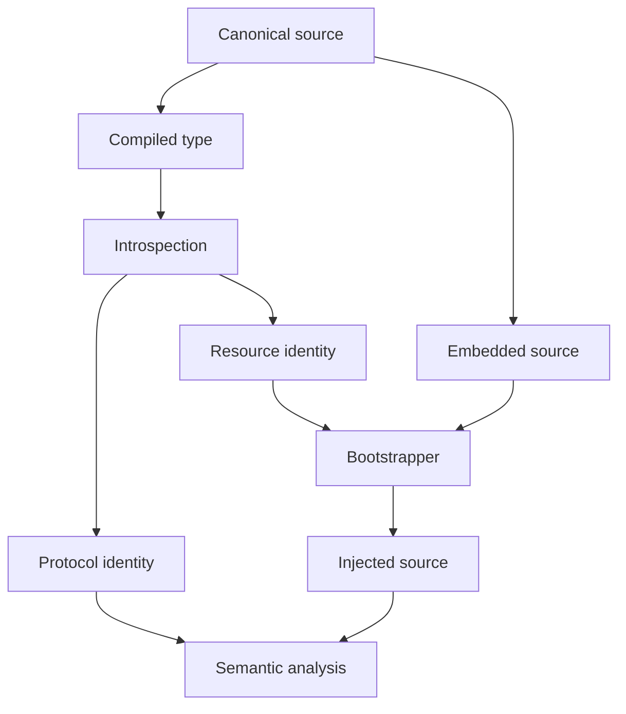
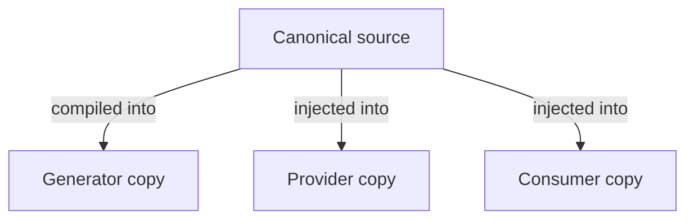
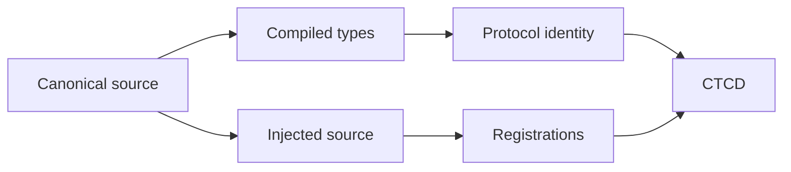

# Canonical Embedded Source Introspection (CESI) Pattern

## Intent

Maintain small source-level protocols used by a Roslyn generator from a **single canonical C# definition** that is simultaneously:

- compiled into the generator assembly, so generator code can refer to and introspect the protocol using ordinary CLR type metadata;
- embedded into that generator assembly as source text; and
- injected into analyzer-consuming compilations when the protocol must be available there without a normal runtime reference to the generator.

The pattern eliminates parallel declarations and duplicated metadata-name constants inside the generator. The compiled canonical type becomes the generator-side authority for protocol identity, while the embedded source remains the authority for the declaration emitted into consumer compilations.

---

## Problem

Roslyn generators often need tiny declarations to exist on both sides of the analyzer boundary. Typical examples include:

- marker or trigger attributes;
- enum-based protocol vocabularies (see [Compile-Time Contract Discovery (CTCD)](../compile-time-contract-discovery/compile-time-contract-discovery.md));
- small generic registration attributes;
- generated-code annotations;
- compile-time configuration markers;
- source-level helper interfaces.

A naïve implementation maintains several representations of the same concept:

- generator-side C# declaration;
- embedded or generated consumer declaration;
- fully qualified metadata name and generic arity;
- embedded-resource name.

These representations can drift independently. A namespace move, type rename, generic-arity change, or protocol refactoring can leave the generator compiling while silently searching for the wrong symbol or injecting stale source.

The central problem is therefore not merely source embedding. It is **maintaining one authoritative declaration across two compilation domains while preserving a reliable identity bridge between them**.

---

## Applicability

Use this pattern when:

- a generator must inject a small protocol or API surface into consuming compilations;
- the generator itself also needs to understand that protocol structurally;
- giving consumers a normal reference to the generator assembly is undesirable;
- duplicating declarations between generator code and emitted source would create maintenance risk;
- metadata-name matching is required across independently compiled copies of the same source declaration;
- protocol declarations are small, stable, and meaningful at compile time.

Do not use this pattern merely to avoid an ordinary shared runtime dependency when such a dependency is architecturally appropriate. Large runtime implementations, stateful services, and normal reusable libraries should remain ordinary referenced assemblies.

---

## Structure



The canonical source participates in two build outputs, but it is maintained only once.

---

## Participants

### Canonical Source Unit

A normal C# source file containing one or more small declarations that define a generator-facing protocol.

The source unit is both compiled into the generator and embedded as source text. The project therefore consumes the same file twice:

```xml
<ItemGroup>
  <Compile Include="CanonicalProtocol.cs" />
  <EmbeddedResource Include="CanonicalProtocol.cs" />
</ItemGroup>
```

### Generator-Side Canonical Type

A type compiled from the canonical source into the analyzer assembly.

Generator code uses ordinary CLR introspection over this type to derive stable facts such as:

- namespace;
- type name;
- full name;
- generic arity;
- declaring type for nested declarations;
- enum members and numeric values;
- other generator-local structural information.

This avoids repeating those facts as string constants.

### Embedded Source Resource

The original source text packaged into the generator assembly so the canonical declaration can be reproduced in a consuming compilation.

### Source Identity Resolver

Maps a canonical generator-side type or protocol unit to the embedded source resource that contains its declaration.

The mapping may be convention-based or explicit, but it should itself have a single authoritative definition rather than being repeated throughout generator code.

### Bootstrapper

Reads the canonical embedded source and injects it into the analyzer-consuming compilation, normally during Roslyn post-initialization.

### Protocol Consumer

The generator logic that analyzes symbols, attributes, enum values, generic shapes, or other structures involving the injected protocol.

It derives protocol identity from the compiled canonical type rather than repeating its fully qualified metadata name manually.

---

## Collaboration

The build and generation lifecycle is:

1. Compile and embed the same canonical protocol source.
2. Refer to the compiled protocol type directly from generator code.
3. Resolve the embedded source from the canonical type or protocol unit.
4. Inject that source during post-initialization.
5. Inspect consumer and referenced-assembly symbols.
6. Derive cross-assembly protocol identity from the compiled canonical type and use the resolved symbols for diagnostics and generation.

The two copies of the protocol type are intentionally **not the same CLR or Roslyn symbol identity**. Their relationship is established by canonical source provenance and protocol metadata identity.

---

## Canonical Source as the Single Source of Truth

The central invariant is:

> A protocol declaration is authored once as ordinary C# source. Every generator-side representation and every injected consumer-side representation is derived from that source.

For a protocol type `T`, generator code should prefer structural introspection such as:

```csharp
typeof(T).FullName
```

or a metadata-name helper based on `typeof(T)` over constants such as:

```csharp
"Some.Namespace.ProtocolType`1"
```

The same applies to enum members and other protocol facts that the generator itself can obtain from the compiled declaration, e.g., via `nameof(T.SomeEnumValue)` or `typeof(T).GetEnumNames()`.

The goal is not reflection for dynamic discovery. The generator is introspecting **its own statically referenced canonical protocol types**, which are part of the analyzer assembly itself.

---

## Source Identity and Protocol Identity

The pattern distinguishes two identities.

### Protocol Identity

Answers:

> Which declaration does this type represent across independently compiled assemblies?

For Roslyn symbol discovery this is commonly represented by the full CLR metadata name, including:

- namespace;
- containing types;
- nested-type separators;
- generic arity.

Protocol identity should be derived from the canonical compiled type.

### Source-Unit Identity

Answers:

> Which embedded source resource must be injected to reproduce this canonical declaration?

This may be represented by:

- a deterministic resource-name convention derived from the canonical type;
- a build-generated type-to-resource manifest;
- an explicit association declared once at build time.

Protocol identity and source-unit identity are related but distinct; keeping them separate avoids coupling metadata identity to file or resource layout.

---

## Resource Association

A robust implementation should make the association between canonical type and embedded source explicit or mechanically derivable.

For simple one-type-per-file protocols, the build may assign resource logical names according to a convention derived from the type's metadata identity. The bootstrapper can then resolve source using only `typeof(T)`.

For source units containing multiple declarations or non-conventional layouts, use a canonical manifest or another build-time association rather than scattering resource-name literals through generator code.

The architectural requirement is:

> Renaming or moving the canonical protocol declaration should require changing its source declaration and, at most, one canonical build association. Feature-generator code should not require synchronized string edits.

---

## Post-Initialization Bootstrapping

Static protocol source is normally injected through `RegisterPostInitializationOutput` because it:

- does not depend on user syntax;
- does not depend on semantic analysis of the active compilation;
- is invariant for a particular generator build;
- must be available to later compilation analysis and to user source.

Conceptually:


The bootstrapper should be generic over canonical protocol types or source units where practical, so adding another bootstrapped declaration does not require recreating the loading mechanism.

---

## Cross-Assembly Identity

Because every analyzer-consuming assembly may receive its own internal copy of the bootstrapped source, equivalent protocol declarations in different assemblies do not share symbol identity.

For example:



Therefore, any pattern that discovers protocol use across referenced assemblies must compare the intended protocol identity rather than `System.Type` or `INamedTypeSymbol` identity across those boundaries.

The compiled canonical type gives the generator an authoritative protocol metadata name without hard-coding it.

---

## Invariants

### One Canonical Declaration

The generator-side type and injected consumer-side declaration originate from the same maintained source text.

### Introspected Protocol Identity

Metadata names, generic arity, enum values, and similar protocol facts are derived from compiled canonical declarations whenever practical rather than duplicated as literals.

### Deterministic Source Association

A canonical protocol type or source unit maps deterministically to the embedded source that defines it.

### No Consumer Runtime Dependency on the Analyzer

Source bootstrapping does not require the application or runtime assembly to reference the generator assembly as a normal runtime dependency.

### No Analyzer-Time Loading of Consumer Assemblies

The pattern only introspects types compiled into the generator itself. Consumer and provider assemblies remain Roslyn symbols and are not loaded through runtime reflection.

### Exact Source Reproduction

The source emitted to consumers is the embedded canonical source, not a separately reconstructed approximation of its declarations.

### Fail Fast on Broken Packaging

A missing or ambiguous canonical resource is an analyzer packaging/build defect and should fail deterministically rather than silently substituting generated fallback declarations.

---

## Consequences

### Benefits

- Eliminates drift between generator-side protocol declarations and emitted consumer declarations.
- Eliminates most hard-coded fully qualified protocol type names.
- Makes namespace moves and generic-shape changes significantly safer.
- Preserves normal C# type checking inside the generator for protocol enums, generic declarations, and helper APIs.
- Allows internal protocol surfaces to be shared across compilation boundaries without introducing a runtime package solely for those declarations.
- Centralizes source loading and injection infrastructure.
- Composes naturally with metadata-name-based contract and extension discovery.
- Keeps analyzer packaging self-contained when the protocol source is embedded directly in the generator assembly.

### Costs

- The build must intentionally compile and embed the same source unit.
- Embedded-resource naming or manifest generation becomes part of analyzer packaging correctness.
- Independently injected copies require explicit metadata-identity semantics when scanning referenced assemblies.
- The technique is appropriate only for small compile-time protocols; using it for large reusable APIs produces unnecessary source duplication.
- Tooling and tests must account for generated internal declarations appearing in multiple compilations.

---

## Variations

### Type-Per-Resource Convention

Each canonical bootstrapped type is defined in its own source file, and resource identity is derived mechanically from the compiled type.

This is the simplest variation and provides the strongest correspondence between type identity and source identity.

### Protocol-Unit Resource

A single embedded source unit contains a cohesive family of declarations, such as an enum plus its registration attribute.

The generator identifies the unit through one canonical anchor type and injects the whole source unit atomically.

### Build-Generated Resource Manifest

The build emits a manifest mapping canonical type metadata identities to resource names. This avoids relying on physical file-name conventions while preserving introspection-driven lookup.

### Explicit Canonical Association

A small central table or build declaration maps canonical types to source resources. This introduces one mapping artifact but still avoids duplicating protocol declarations and metadata names throughout feature-generator code.

### Generated Source Instead of Embedded Source

For declarations that are genuinely mechanical, the canonical representation may be a structured model from which both generator-side and consumer-side source are generated during the analyzer build.

This preserves the single-source-of-truth principle but is a different implementation strategy. Embedding ordinary C# is usually simpler when the protocol is naturally expressed as C# declarations.

---

## Relationship to [Compile-Time Contract Discovery (CTCD)](../compile-time-contract-discovery/compile-time-contract-discovery.md)

CTCD often needs a registration attribute and contract vocabulary in multiple analyzer-consuming assemblies while the generator retains its own understanding of those declarations.

CESI supplies that protocol safely:



The patterns are independent:

- **CESI** answers how one source-level protocol is kept authoritative across analyzer and consumer compilation domains.
- **CTCD** answers how semantic roles registered through that protocol are resolved from Roslyn symbols.

Contract discovery can use a normal shared protocol assembly instead, and embedded-source bootstrapping can support protocols unrelated to contract discovery.

---

## Relationship to [Compile-Time Symbolic Binding (CTSB)](../compile-time-symbolic-binding/compile-time-symbolic-binding.md)

A symbolic binding DSL may use small attributes, marker types, or enum vocabularies that extensions must reference. CESI can provide those declarations without a dedicated runtime protocol assembly; CTSB governs how their uses are discovered, selected, and lowered.

---

## Failure Modes

### Maintaining Generator and Consumer Declarations Separately

Two hand-written copies eventually diverge in namespace, generic shape, members, accessibility, or semantics.

### Hard-Coded Protocol Metadata Names

The canonical type is renamed but discovery code continues searching for an obsolete string.

### Hard-Coded Resource Names Throughout Feature Code

Source injection works until a file or resource layout changes. Resource resolution should be centralized and associated with canonical types or source units.

### Assuming Source Identity Implies Symbol Identity

The same canonical source injected into two assemblies produces distinct CLR/Roslyn type identities. Cross-assembly discovery must intentionally use protocol metadata identity.

### Reconstructing Source from Reflection

Generating a declaration by reflecting over the compiled type loses source-level information and creates a second rendering implementation. Embed and reproduce the canonical source instead.

### Loading Consumer Assemblies for Symmetry

The fact that generator-owned canonical types are safely introspected does not justify loading referenced consumer assemblies into the analyzer process. Those remain Roslyn symbols.

### Embedding Large Runtime APIs

Source injection is not a substitute for ordinary library distribution. Large, behavior-rich APIs should generally be shared through normal references.

### Silent Missing Resources

Falling back to reconstructed or stale source when an embedded resource is absent hides analyzer packaging defects. Broken canonical-source packaging should fail deterministically.

---

## Architectural Summary

The pattern establishes a source-level bridge across the analyzer boundary without parallel protocol definitions. Its essential property is that **the generator understands the same declaration it injects because both representations originate from one canonical source file**.

The compiled type eliminates duplicated generator-side identity constants. The embedded source eliminates duplicated consumer-side declarations. Together they turn protocol maintenance into ordinary C# refactoring rather than synchronized edits across source templates, metadata strings, and analyzer logic.
