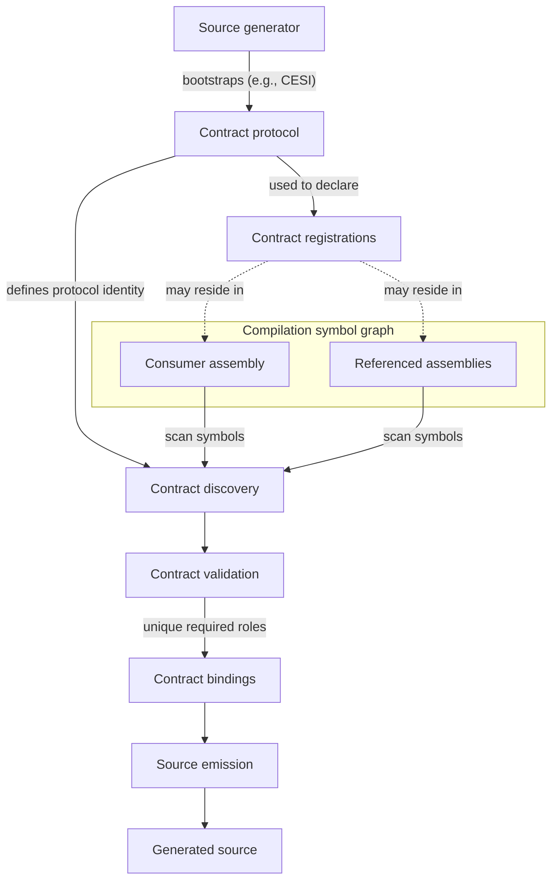
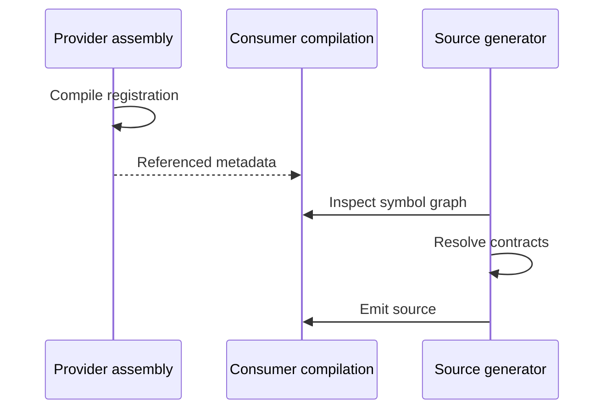

# Compile-Time Contract Discovery (CTCD) Pattern

## Intent

Decouple a Roslyn source generator from concrete runtime or framework types that generated code must reference.

Runtime, framework, application, or extension assemblies register concrete types against stable semantic contract roles. The generator discovers those registrations from the active `Compilation` and its referenced assemblies, resolves them to Roslyn symbols, validates the resulting contract set, and emits code against the resolved symbols.

The pattern provides **compile-time dependency inversion** without runtime reflection, analyzer-time assembly loading, or fragile hard-coded implementation type names.

---

## Problem

A source generator often needs to emit code that refers to types owned by the compilation it is analyzing or by one of that compilation's references. A direct generator-to-runtime project reference may be undesirable or impossible because it can:

- reverse the intended dependency direction;
- create a project or package cycle;
- couple the generator to a concrete assembly layout;
- require analyzer-time dependency loading;
- make implementation types difficult to relocate or replace.

Hard-coded metadata names avoid a direct assembly reference but still couple generation to concrete namespaces, type names, generic arity, and assembly organization.

The generator instead needs a stable way to ask:

> Which type fulfills this semantic role in the current compilation environment?

---

## Applicability

Use this pattern when all of the following are substantially true:

- generated code must reference runtime-owned or extension-owned types;
- the generator should not directly reference the assemblies that own those types;
- the semantic role is more stable than the concrete implementation type;
- the role should resolve deterministically at compile time;
- missing or ambiguous role providers should be build errors rather than runtime failures.

Typical generated concerns include factories, adapters, serializers, mapping infrastructure, validation glue, DI wiring, dispatch code, and generated runtime integration.

Do not introduce the pattern when a generator intentionally depends on one stable public framework type and direct metadata-name lookup is sufficient.

---

## Structure

The protocol may come from [CESI](../canonical-embedded-source-introspection/canonical-embedded-source-introspection.md) source bootstrap, a shared reference assembly, or another compile-time-visible representation. Registrations must remain discoverable through Roslyn symbols without executing referenced assemblies.

---

## Participants

### Contract Vocabulary

Defines the semantic roles understood by a cohesive generator or feature family.

A contract role represents meaning, not a concrete type identity. Examples of appropriate roles are execution context, result factory, descriptor abstraction, service provider, or worker interface.

Keep contract vocabularies small and cohesive; unrelated generators should not share a registry without a real architectural contract.

### Contract Registration Protocol

Associates a concrete type with a semantic role in metadata visible to Roslyn.

A registration carries at least:

- the contract family or protocol identity;
- the contract member or semantic role;
- the registered type, normally implied by the annotated declaration.

The registration mechanism may use attributes or another symbolically discoverable representation.

### Contract Provider

A runtime, framework, application, or extension type that declares itself as the implementation of one semantic role.

The provider remains ordinary compiled code. Registration does not require the generator to load or instantiate the type.

### Contract Explorer

Traverses the current compilation assembly and relevant referenced assembly symbols, identifies registrations, and builds a raw role-to-symbol mapping.

Discovery operates entirely on Roslyn's symbol graph.

### Contract Validator

Verifies protocol correctness and semantic shape. Typical validation includes:

- required roles are present;
- single-provider roles are unique;
- protocol values are recognized and version-compatible;
- registered types satisfy required structural constraints;
- generated code can legally reference the resolved symbols.

### Typed Contract Bindings

An immutable, generator-specific facade over the resolved symbols.

Generation logic consumes semantic properties such as `ExecutionContext` or `ResultFactory`, not raw enum values, dictionaries, or hard-coded names.

### Renderer / Generation Backend

Uses the resolved symbols as part of its generation model and emits fully qualified type references or member accesses.

It does not rediscover contracts and does not need to know which assembly supplied a role.

---

## Collaboration

The generator never executes provider code during this collaboration.

---

## Contract Identity

A cross-assembly registration protocol must have an identity that survives independent compilation.

If protocol definitions are source-injected separately into multiple assemblies, CLR/Roslyn symbol identity cannot be assumed to be shared. In that design, discovery must recognize the protocol through a stable representation such as exact fully qualified metadata names plus stable protocol values.

If contract members are persisted as enum constants or numeric identifiers, those values form part of the cross-assembly protocol and must be explicitly assigned and version-stable.

The protocol must not silently reinterpret unknown values from another version.

---

## Cardinality

The canonical relationship is `contract family + semantic role → exactly one registered type`.

For a required single-provider contract:

- zero registrations is an error;
- one registration resolves successfully;
- more than one registration is an ambiguity error.

Do not weaken this invariant to support extensibility sets. A many-provider extension registry is a different abstraction with different conflict semantics.

---

## Resolution Lifecycle

1. Establish the contract protocol visible to participating assemblies.
2. Compile registrations into the providing assemblies.
3. Enumerate the current compilation and referenced assembly symbols.
4. Identify registrations belonging to the relevant contract family.
5. Resolve protocol values to semantic roles.
6. Detect malformed, unknown, duplicate, and missing registrations.
7. Validate the structural shape of each resolved symbol.
8. Construct immutable typed contract bindings.
9. Build generation models using the resolved symbols.
10. Emit source using fully qualified symbol-derived references.

Contract errors should stop dependent generation rather than allowing cascades of secondary C# errors.

---

## Incremental-Generator Integration

Contract discovery is compilation-dependent. Syntax or attribute target discovery can remain fine-grained and incremental, while contract resolution is combined with the active `Compilation` at the point where generation requires external semantic roles.

Keep mutable registries and identity-sensitive helpers out of the incremental value graph. Prefer value-semantic candidate models and localize symbol-oriented contract resolution unless measurement justifies deeper caching.

---

## Invariants

### Compile-Time Only

Referenced assemblies are inspected through Roslyn symbols. The analyzer does not use reflection, `Assembly.Load`, runtime probing, or service activation to resolve contracts.

### Semantic Registration

Contracts describe stable roles. They are not aliases for whatever concrete type name a renderer currently finds inconvenient.

### Deterministic Resolution

A required single-provider contract must resolve identically regardless of reference enumeration order.

### Fail-Closed Behavior

Malformed, unknown, missing, duplicate, or structurally incompatible required contracts prevent dependent source emission.

### Symbol-Based Emission

Generated code references the resolved Roslyn symbols rather than reproducing implementation names from strings.

### Stable Protocol Identity

Cross-assembly registration identity and persisted contract values are explicit and version-aware.

### Immutable Resolved State

Resolved contract bindings are treated as compilation input metadata, not mutable generator state.

---

## Consequences

### Benefits

- Inverts analyzer/runtime dependencies without runtime discovery.
- Allows implementation types to move between namespaces or assemblies without changing generator logic.
- Converts missing runtime capabilities into compile-time diagnostics.
- Supports referenced assemblies contributing generator dependencies transitively.
- Produces explicit static references suitable for trimming and native-AOT scenarios.
- Centralizes generator assumptions about runtime-owned types.

### Costs

- Introduces a compile-time protocol that must be versioned deliberately.
- Requires discovery and diagnostic infrastructure.
- Can require scanning referenced assembly symbol graphs.
- Adds architectural ceremony that is unjustified for fixed framework types.
- Source-injected protocol definitions require careful handling of metadata identity and accessibility.

---

## Variations

### Source-Injected Protocol

The generator emits registration attributes and contract vocabulary into participating compilations. This avoids a normal shared runtime reference but requires protocol recognition across independently compiled internal type copies.

### Shared Protocol Assembly

A small normal reference assembly defines the registration vocabulary. This simplifies type identity but introduces an ordinary shared dependency. It is appropriate when that dependency direction is acceptable.

### Optional Contracts

A contract family may contain optional roles. Requiredness must be explicit; absence of an optional role represents capability absence rather than invalid configuration.

### Versioned Contract Families

Incompatible protocol changes may be modeled by a new contract-family identity or explicit protocol version instead of relying on assembly version coincidence.

---

## Related Patterns

### Target / Extension Discovery

Target discovery asks which declarations should receive generated behavior. Contract discovery asks which unique external symbols fulfill generator-required roles. A generator commonly uses both, but their cardinality and failure semantics differ.

### [Compile-Time Symbolic Binding (CTSB)](../compile-time-symbolic-binding/compile-time-symbolic-binding.md)

CTSB extends the same dependency-inversion idea from singular contracts to conditional rule selection and lowering.

### [Canonical Embedded Source Introspection (CESI)](../canonical-embedded-source-introspection/canonical-embedded-source-introspection.md)

CESI keeps source-injected contract vocabularies canonical across analyzer and consumer compilation domains.

---

## Failure Modes

### Hard-Coded Runtime Type Names

The generator appears independent of the runtime assembly but remains coupled to namespaces, type names, and assembly layout.

### Analyzer-Time Reflection

Loading referenced assemblies into the analyzer process replaces compile-time dependency inversion with fragile runtime plugin loading.

### Silent Duplicate Resolution

Choosing the first registration makes output depend on reference ordering and hides architectural ambiguity.

### Unstable Persisted Contract Values

Implicit enum numbering or reused identifiers can cause independently compiled registrations to be reinterpreted incorrectly.

### Protocol Identity by Simple Name

Matching only short type names can accidentally accept unrelated registrations.

### Contract Dictionaries Leaking Into Rendering

Passing raw protocol maps throughout the generator spreads dependency knowledge and weakens the semantic boundary.

---

## Architectural Summary

The pattern replaces concrete generator-to-runtime dependencies with a small compile-time semantic protocol: a semantic role resolves to a registered symbol, is validated, and is emitted as a static reference.

Its essential property is that **the assembly owning a runtime capability declares the symbol that fulfills the role, while the generator discovers that declaration through Roslyn instead of depending on the implementation assembly**.

---

## Minimal Sample

A small .NET solution demonstrates the source-injected, enum-based variation in the [CESI + CTCD sample](../../samples/cesi+ctcd-patterns/README.md).

It focuses on canonical protocol bootstrapping, cross-assembly registration discovery, uniqueness validation, and symbol-based emission.
