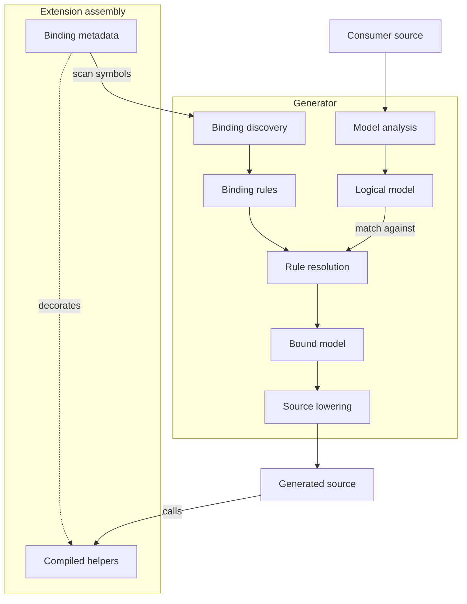
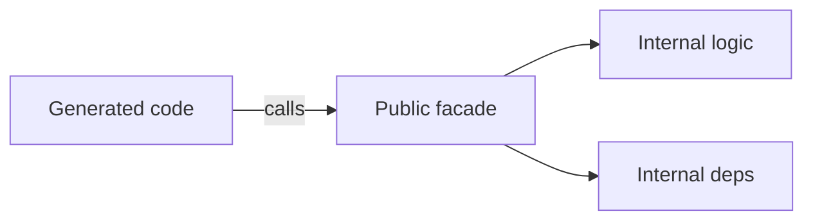

# Compile-Time Symbolic Binding (CTSB) Pattern

## Intent

Allow referenced assemblies to contribute conditional generation behavior to a Roslyn source generator without loading provider or extension code into the analyzer process and without requiring one source generator per extension.

Extension assemblies publish a **structural binding map** that describes when a capability applies and which callable symbols or types implement it. The core generator discovers those declarations from the active `Compilation`, resolves them against a generation model, and **lowers the selected symbolic bindings into concrete generated source** that directly references the corresponding compiled operations.

CTSB therefore separates three concerns:

- **selection semantics**, represented declaratively and interpreted by the generator;
- **lowering semantics**, which translate resolved symbolic bindings into concrete generated source; and
- **implementation algorithms**, represented as ordinary compiled C# owned by the contributing extension assembly.

The generator owns structural interpretation and lowering; extension assemblies own the algorithms behind the selected symbols.

--- 

## Problem

A generator may need extension-specific behavior that cannot be hard-coded into the generator itself. Conventional plugin approaches are awkward in analyzer environments because generation-time dependencies must be loaded into the analyzer process and often require fragile packaging and dependency-resolution arrangements.

Embedding every extension rule centrally couples the generator to all known extensions. A purely declarative DSL avoids that coupling but becomes unmaintainable if it must express arbitrary runtime algorithms.

The generator needs a way to ask:

> Given this compile-time generation state, which referenced capability applies, and which ordinary compiled operation should the generated program call?

---

## Applicability

Use this pattern when:

- one core generator must support independently versioned provider or extension assemblies;
- extension-specific behavior can be selected from compile-time structure;
- selected behavior may require arbitrarily complex runtime implementation code;
- analyzer-time plugin loading is undesirable;
- generated code can statically reference a stable extension-owned ABI;
- conflicts and unsupported combinations should be diagnosed at compile time.

The pattern is particularly suitable for source-generated binding, serialization, protocol adaptation, mapping, conversion, factories, dispatch, interoperability layers, and generated infrastructure with pluggable backends.

---

## Structure



The generator observes extension declarations and helper signatures through Roslyn symbols. It does not instantiate extension types or execute extension code while generating.

---

## Relationship to [Compile-Time Contract Discovery (CTCD)](../compile-time-contract-discovery/compile-time-contract-discovery.md)

CTCD and CTSB share the same dependency-inversion principle but solve different cardinalities.

Contract discovery resolves `semantic role → exactly one symbol`; symbolic binding resolves `generation state → matching rules → selected operations`.

Contract discovery is appropriate for unique infrastructure anchors. Symbolic binding is appropriate for extensible behavior tables.

A generator may use contract discovery to resolve its fixed runtime anchors and symbolic binding to resolve extension-provided operations.

---

## Participants

### Logical Generation Model

A provider-neutral or extension-neutral representation of what generated code must accomplish.

The logical model contains semantic facts derived from consumer source and compilation analysis. It does not contain extension-specific implementation details.

### Binding Vocabulary

Defines the structural concepts that extension declarations can use to express applicability and selection.

Typical categories include:

- predicates over symbols, types, configuration, capabilities, or operation modes;
- composition operators such as conjunction, disjunction, negation, or precedence;
- operation roles such as reader, writer, converter, factory, validator, or adapter;
- argument-binding sources available to generated code.

The vocabulary may be encoded with attributes, generic marker types, Curiously Recurring Template Pattern (CRTP)-style structural types, or another representation that Roslyn can inspect without executing.

### Binding Declaration

A declaration contributed by a referenced assembly that connects a structural condition to one or more operation symbols.

Conceptually, a declaration says `when <condition> → use <operation>`. It describes **selection**, not the implementation algorithm.

### Compiled Operation

An ordinary method, type, factory, or helper implemented by the extension assembly and callable by generated consumer code.

The operation may contain arbitrary logic. Its complexity is intentionally outside the binding DSL.

### Binding Explorer

Discovers binding declarations from the current compilation and referenced assemblies using Roslyn symbols.

It treats extension assemblies as metadata contributors, not executable analyzer plugins.

### Binding Resolver

Evaluates binding conditions against the logical generation model, applies ordering or specificity rules, detects ambiguity, and selects the operation symbols that implement the required capabilities.

### Operation Binder

Validates callable shapes and maps generated values to operation parameters.

It determines how a selected operation can be invoked from generated code without executing the operation during generation.

### Bound Generation Model

The logical generation model after extension-specific symbolic resolution.

It contains selected symbols, concrete types, bound arguments, and lowering decisions sufficient for a generic emitter to produce ordinary C#.

### Source Emitter

Emits direct calls, constructions, casts, conversions, or other statically representable operations from the bound model.

The emitter should not contain extension-specific switches when the binding map can express the distinction.

---

## Structural Rule Representation

The pattern does not require one concrete DSL syntax. The representation must have these properties:

- it is compiled into ordinary assembly metadata;
- Roslyn can reconstruct its structure from symbols and attributes;
- the generator does not need to execute provider code to interpret it;
- its semantics are deterministic and versionable;
- it can reference operation symbols or operation-owning types.

A generic structural CRTP representation can encode composition naturally. For example, a constructed generic base type can represent a tree such as:

```csharp
Rule<
    All<ConditionA, ConditionB>,
    Use<OperationX>>
```

The important property is the structural tree, not the specific syntax.

---

## Selection Versus Implementation

The central invariant of the pattern is:

> The binding DSL decides **which implementation applies**; ordinary compiled code decides **how the implementation works**.

A rule may select a helper that performs complex conversion, parsing, allocation, caching, I/O preparation, or runtime dependency access. The DSL does not reproduce those algorithms.

This prevents the structural language from evolving into a second general-purpose programming language.


---

## Operation Invocation Contract

A selected compiled operation must expose an ABI that generated consumer code can legally call.

The binding system therefore needs a finite model of **argument sources**. Common sources may include:

- a generated local or target instance;
- a source value;
- a destination value;
- an index or ordinal;
- a name or other compile-time constant;
- a resolved type;
- a runtime context object;
- a service provider or another explicit ambient runtime service.

The specific set is domain-dependent, but it should be explicit and finite.

An operation may either:

1. expose a signature directly bindable from these sources; or
2. expose a public infrastructure facade that accepts bindable inputs and encapsulates internal dependencies.

The generator should not attempt to bypass ordinary accessibility merely to reach extension internals.

---

## Compile-Time Argument Binding

Argument binding maps each `operation parameter → generated value source` at compile time.

The mapping may be conventional, annotated, or represented structurally in the binding declaration.

This resembles dependency injection structurally, but the analyzer constructs no service graph and runs no provider factory. It only selects the runtime expression to emit, such as an `IServiceProvider` lookup or provider-owned facade call.

---

## Encapsulating Internal Dependencies

Generated code lives in the consumer assembly and cannot freely access extension-internal implementation details.

When an operation requires internal dependencies, the extension should expose a narrow generated-code ABI that encapsulates those details.



The facade can be intentionally hidden from normal API discovery while remaining binary-accessible to generated code.

This maintains assembly encapsulation without forcing implementation internals into the binding vocabulary.

---

## Binding Resolution

A binding resolver typically performs these steps:

1. Discover structural binding declarations from the compilation and referenced assemblies.
2. Parse each declaration into a value-semantic rule model.
3. Validate rule structure and operation references.
4. Determine which rules are applicable to the logical generation state.
5. Apply specificity, priority, or composition semantics.
6. Reject ambiguous or conflicting selections.
7. Validate the selected operation's accessibility and callable shape.
8. Bind operation parameters to generated value sources.
9. Produce a bound generation model.
10. Emit direct source references to the selected symbols.

No extension code runs during these stages.

---

## Rule Cardinality and Conflict Semantics

Unlike single-slot contract discovery, many binding declarations may legitimately coexist.

The binding vocabulary therefore needs explicit resolution semantics. Common models include:

- exactly one applicable rule;
- most-specific rule wins;
- explicit numeric or semantic priority;
- ordered composition of multiple applicable rules;
- one rule per operation role;
- additive registrations for independent capabilities.

The chosen semantics must be deterministic and diagnosable. Reference enumeration order must never be an implicit precedence mechanism.

---

## Layered Lowering

Complex generators benefit from explicit lowering stages. The logical model carries semantics, the bound model carries concrete Roslyn symbols, and lowering converts those choices into C#. This keeps extension-specific concerns out of consumer-source analysis.

---

## Invariants

### No Analyzer-Time Extension Execution

The generator inspects referenced assemblies through Roslyn. It does not instantiate factories, execute registration code, or dynamically load provider implementations.

### Structural Metadata Is Declarative

Binding declarations describe applicability, selection, and invocation shape. Arbitrary algorithms remain compiled operations.

### Extension-Owned Implementation

The assembly that understands an extension-specific behavior owns the implementation helper and its stable generated-code ABI.

### Core-Owned Resolution Semantics

The core generator owns the interpretation of the binding vocabulary, conflict semantics, validation, and source lowering.

### Symbolic References

Rules ultimately resolve to Roslyn symbols, not source snippets or stringly typed fragments whenever a real symbol exists.

### Accessibility Is Preserved

Generated code calls only members legally accessible from the generated assembly. Internal complexity is hidden behind callable facades rather than bypassed.

### Deterministic Selection

Equivalent compilations and reference sets produce the same binding result independent of enumeration order.

### Fail-Closed Binding

Malformed rules, incompatible operation signatures, unsupported states, and ambiguous selections produce generator diagnostics and prevent invalid dependent emission.

---

## Consequences

### Benefits

- Supports independently versioned extensions with one core generator.
- Avoids analyzer-time dependency loading and plugin activation.
- Keeps arbitrary provider algorithms in normal C# rather than a custom DSL.
- Allows generated code to call highly optimized, provider-specific compiled helpers.
- Centralizes matching, validation, and source emission in one generator architecture.
- Makes extension capability absence and ambiguity compile-time concerns.
- Supports AOT- and trimming-friendly static wiring.
- Allows provider behavior to evolve without expanding a central provider switch.

### Costs

- Introduces a structural binding protocol that requires deliberate versioning.
- Requires a matching and conflict-resolution engine.
- Requires a stable externally callable ABI for operations invoked from generated consumer code.
- Can create significant abstraction complexity if the DSL grows without clear boundaries.
- Symbol discovery across large reference graphs may require later performance work.
- Generic structural DSLs can produce difficult diagnostics unless the generator translates malformed structures into domain-level error messages.

---

## Variations

### Attribute-Based Binding Maps

Conditions and operation references are expressed through attributes. This is straightforward to inspect but can become verbose for deeply compositional rules.

### Generic Structural DSL

Constructed generic types encode a rule tree. This supports strong structural composition and CRTP-style reusable vocabulary while remaining inspectable through `INamedTypeSymbol` relationships.

### Hybrid Representation

Attributes identify binding declarations while generic base types or interfaces carry compositional structure.

### Direct Intrinsics

For trivial operations, a binding may lower directly to a method or constructor symbol and the generator emits the call without an additional helper facade.

### Runtime Helper Operations

For complex behavior, the binding selects a provider-owned helper method or type. The generator emits only the invocation boundary.

### Fixed Operation Contexts

Instead of arbitrary argument binding, the architecture may define a small set of standard context types per operation role. This reduces meta-binding flexibility in exchange for a simpler ABI.

### Symbolic Argument Binding

A richer system allows operation parameters to declare their source from a finite compile-time vocabulary. This provides composability similar to dependency injection while still emitting normal runtime code.

---

## Forces and Tradeoffs

### Expressiveness Versus Protocol Stability

A more capable structural DSL can represent more extension logic but increases versioning surface and diagnostic complexity. Prefer extending selection vocabulary only when real binding cases require it.

### Direct Emission Versus Helper Calls

Directly emitted operations can produce simpler and faster generated code for trivial behavior. Helper calls provide a stable complexity firewall for sophisticated implementation logic.

### Generic DSL Versus Readability

Generic type trees are strongly structured and easily consumed through Roslyn symbols, but deeply nested constructions can become difficult for humans and diagnostics. The source representation should remain secondary to the semantic rule model the generator exposes in errors and tooling.

### Public ABI Versus Encapsulation

Generated consumer code requires externally callable symbols. Provider assemblies may need a small infrastructure surface whose purpose is generated-code interoperability rather than direct user consumption.

---

## Failure Modes

### Turning the DSL Into a Programming Language

Encoding arbitrary conversion or runtime algorithms in structural rules makes the metadata layer harder to maintain than ordinary C#.

### Analyzer Plugin Loading

Loading extension assemblies or generator backends into the analyzer process reintroduces dependency-resolution and isolation problems that the pattern is intended to avoid.

### String-Based Source Injection

Bindings that contribute arbitrary source snippets bypass symbol validation, accessibility checking, refactoring safety, and deterministic composition.

### Hidden Reference-Order Precedence

Selecting the first matching provider makes generation sensitive to build-system reference ordering.

### Provider Logic in the Core Renderer

A growing switch over extension-specific types or names indicates that binding resolution has leaked through the abstraction boundary.

### Internal Symbols Referenced Directly

Emitting calls to inaccessible helper types produces brittle code and breaks encapsulation. Internal implementation should be surfaced through a stable callable facade.

### Arbitrary Meta-DI

Allowing operation signatures to request unconstrained generator-known dependencies can turn argument binding into an implicit service locator. Keep bindable sources finite and architectural.

---

## Architectural Summary

The pattern establishes a compile-time extension boundary. Its defining separation is:

> **Referenced assemblies declaratively describe when their capabilities apply and which symbols implement them; the core generator resolves those declarations symbolically and emits ordinary code that calls the selected compiled implementations.**

This extends compile-time contract discovery from singular dependency resolution into a general compile-time capability and lowering mechanism without turning the analyzer host into a runtime plugin container.
