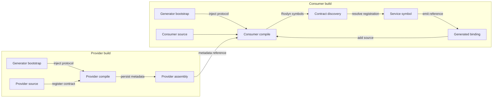

# Compile-Time Contract Discovery Sample

Minimal sample of [Compile-Time Contract Discovery (CTCD)](../../patterns/compile-time-contract-discovery/compile-time-contract-discovery.md) using [Canonical Embedded Source Introspection (CESI)](../../patterns/canonical-embedded-source-introspection/canonical-embedded-source-introspection.md).

It demonstrates four things:

1. The generator owns one canonical enum-based contract protocol.
2. The protocol source is compiled into the generator and also bootstrapped into analyzer-consuming compilations.
3. A provider assembly registers a concrete runtime type against a semantic contract.
4. A downstream consumer generator discovers that registration from the provider's assembly metadata and emits code against the resolved Roslyn symbol.

The provider and consumer each receive their own internal copy of the protocol types. Discovery therefore matches the protocol by stable metadata name and enum value, not by Roslyn symbol identity.

## Projects

- `ContractDiscovery.Generator`: generator plus canonical bootstrapped protocol source.
- `ContractDiscovery.Provider`: registers `DemoService` for `DemoContract.Service`.
- `ContractDiscovery.Consumer`: references the provider and emits code against the discovered service.

## Data flow



## Expected result

Building and running `ContractDiscovery.Consumer` should print:

```text
Hello from the discovered provider contract.
```

The consumer source never names `DemoService`. Its generated `ResolvedContracts.CreateService()` method returns the provider type discovered from the referenced assembly.

## Scope

The sample omits production hardening such as protocol versioning, rich diagnostics, caching, shape validation, packaging, and dedicated generator tests so the core mechanism stays easy to inspect.
